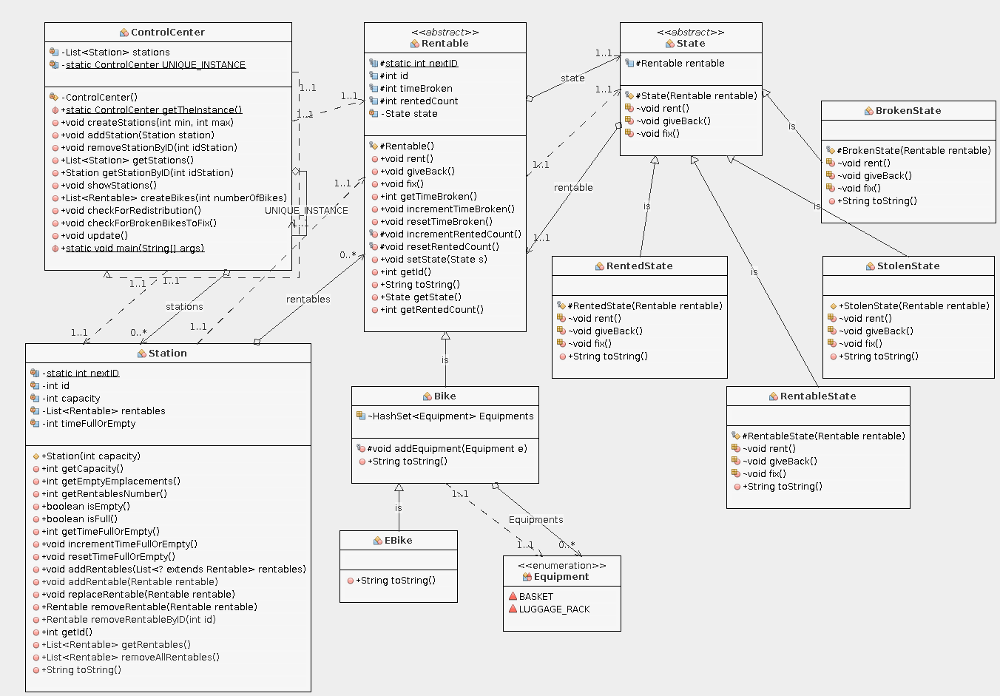

# COO L3 G06 - Vanrobaeys Hugo - Mohamed Said Aimen LAMRI 

# Sujet du projet 

Notre simulation repose sur un écosystème composé de stations de location, de vélos classiques et électriques, et d'un centre de contrôle supervisant l'ensemble de la flotte. L'objectif de ce projet est de modéliser le fonctionnement réaliste d'un service de vélos en libre-service, avec des fonctionnalités telles que la redistribution des vélos entre les stations, la gestion de différents états de vélos, et même la possibilité d'étendre le système à d'autres moyens de déplacement urbain, comme les trottinettes électriques.

# How To

## Récupérer les sources du projet 

Exécuter la commande suivante dans le terminal pour récupérer le dépôt git du projet :

```
git clone https://github.com/lamriaimen/simulation-of-a-control-center-of-a-transportation-company.git
```
    
## Générer la documentation

Dans le dossier du projet `simulation-of-a-control-center-of-a-transportation-company`, exécuter la commande suivante dans le terminal :

```
make docs
```

La javadoc générée se trouve dans le dossier `docs`.

##  Compiler et exécuter les sources

Dans le dossier du projet `simulation-of-a-control-center-of-a-transportation-company`, exécuter la commande suivante dans le terminal:

```
make all
```

Le main contenant la simulation est contenu dans le controlCenter, exécuter la commande suivante pour lancer la simulation:

```
java -cp ./build controlCenter.ControlCenter
```

> *A noter: d'une exécution à l'autre, notre programme ne donnera pas les mêmes résultats, la simulation étant basée sur différents paramètres et variables aléatoires.*

## Compiler et exécuter les tests

Dans le dossier du projet `simulation-of-a-control-center-of-a-transportation-company`, exécuter la commande suivante dans le terminal:

```
make run_tests
```

## Générer l'archive

Dans le dossier du projet `simulation-of-a-control-center-of-a-transportation-company`, exécuter la commande suivante dans le terminal:

```
make jar
```

L'archive sera générée dans le dossier actuel sous le nom `controlCenter.jar`.


## Exécuter l'archive

dans le dossier du projet `simulation-of-a-control-center-of-a-transportation-company` executer la commande suivante dans le terminal:

```
java -jar controlCenter.jar
```

## Présentation d'éléments de code saillants
    
### Diagramme de classe



### Design Patterns utilisés

#### Singleton :
    ControlCenter

#### State:
    RentableState
    RentedState
    BrokenState
    StolenState

#### decorator:
    Equipement
    


#### Autres:

Contrairement à l'utilisation classique du Design Pattern Observer, notre solution ne repose pas sur des observateurs formels.
Au lieu de cela, à chaque itération de la simulation, une méthode dédiée du centre de contrôle met à jour divers compteurs de temps. 
Ces compteurs sont ensuite utilisés comme repères pour déclencher des actions spécifiques telles que la redistribution des vélos, les réparations, etc.

   
Notre approche de la redistribution des vélos dans les stations est pragmatique, sans recourir à des stratégies superflues, grâce justement à notre système de compteurs décrit précédemment.
Plutôt que d'utiliser un Design Pattern Strategy, nous avons intégré cette fonctionnalité directement dans une méthode du centre de contrôle.

###  conception et mis en œuvre:

Le fichier ControlCenter constitue le cœur du système de gestion des vélos en libre-service. Voici un aperçu de ses principales fonctionnalités et de l'approche  de conception adoptée.

#### Singleton ControlCenter:

Le modèle singleton est appliqué pour garantir l'unicité de l'instance du ControlCenter. 
Cela assure une coordination centralisée de toutes les opérations du système.

#### Gestion des Stations et des Louables :

La conception du système de vélos en libre-service repose sur une gestion dynamique des stations,
orchestrée par des méthodes telles que createStations pour générer aléatoirement des stations diversifiées en capacité, 
et addStation / removeStationByID pour gérer l'ajout et la suppression dynamique de stations.
La gestion des vélos est assurée par createBikes, permettant la création flexible de vélos en fonction des capacités stationnaires.
Ces mécanismes garantissent une simulation réaliste, où l'écosystème de vélos s'adapte en temps réel aux fluctuations de la demande et de l'offre.

#### Vérification de Redistribution :
    
La méthode checkForRedistribution examine l'état des stations, détecte les situations de surcharge ou de vacuité prolongées, 
puis procède à la redistribution des vélos.

#### Vérification des Vélos Cassés :

La méthode checkForBrokenBikesToFix surveille l'état des vélos, identifie les vélos cassés et les soumet à un processus 
de réparation après une période prédéfinie.

#### Mécanisme d'Update :
     
La méthode update orchestre les différentes vérifications et actions, permettant ainsi de simuler le passage du temps 
et d'observer l'évolution du système.

### classes :

#### ControlCenter :

Comme dit précédemment, cette classe est le cœur du système de gestion des vélos en libre-service. Elle est responsable de la création et de la gestion des stations et des vélos, ainsi que de la simulation de la redistribution des vélos, des réparations, etc.

#### Station :
    
Cette classe représente une station de location de vélos. Elle est caractérisée par un identifiant unique, une capacité, une liste de vélos, et un centre de contrôle auquel elle est rattachée.

#### Rentable :
    
Le package "rentable" englobe les classes abstraites `Rentable` et `State`, responsables de la gestion de l'état des vélos. La classe `Rentable` représente tout véhicule mis à disposition avec un identifiant unique, un état, et la possibilité d'ajouter des équipements à l'aide de la classe `Equipement` en tant que décorateur. Ici, 2 types de `Rentable` ont été implémentés, `Bike` et `EBike`, mais cette approche de conception offre une flexibilité, permettant l'ajout potentiel de nouveaux types de Louables et introduire de nouveaux équipements facilement.


### Simulation:

Le bloc main déclenche une simulation en plusieurs étapes, simulant la location et le retour de vélos,
la détection de vols potentiels, et d'autres événements réalistes. Cette simulation démontre la robustesse du système dans 
des scénarios variés.

### Tests 

Nous n'avons pas jugé nécessaire d'utiliser des mocks pour nos tests. Nous avons plutôt concentré nos efforts sur les méthodes cruciales de chaque classe, mettant particulièrement l'accent sur celles dont le comportement varie selon l'état de l'objet.

Dans le package Rentable, nos tests se sont focalisés sur la vérification des transitions correctes entre les différents états de chaque `Rentable` (`Bike` et `EBike`). Nous avons également examiné attentivement le bon fonctionnement des méthodes propres à chaque état. Pour ce faire, nous avons créé une classe de test abstraite, RentableTest, qui regroupe les tests communs entre les deux classes, Bike et EBike. Cette approche a permis une évaluation exhaustive de la cohérence des fonctionnalités de nos louables.

## Conclusion

En conclusion, notre projet reflète notre engagement à respecter les consignes énoncées. Nous avons pris soin de maintenir la propreté de notre dépôt GIT en éliminant tout fichier inutile et en assurant une gestion appropriée via GitLab. La documentation du code, rédigée en anglais, atteste de notre souci de clarté et de compréhension.

Nos tests, élaborés avec soin, contribuent à la robustesse de notre solution. Nous avons scrupuleusement suivi les principes de conception, appliqué différents design patterns, et fourni une représentation UML complète et précise. Notre projet fonctionne de manière globale et peut s'adapter à divers scénarios, démontrant ainsi notre souci de flexibilité.

Nous avons maintenu un avancement régulier, assisté assidûment aux TD/TP, et participé activement à toutes les étapes du projet.